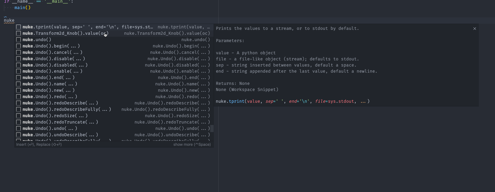

# nuke-snippets README

Visual Studio Code snippets for Nuke Python API.

## Features

The [Nuke Python API documentation](https://learn.foundry.com/nuke/developers/70/pythonreference) converted to snippets. Snippets include description and arguments with vscode snippet style placeholders:

## Known Issues

* The documentation does not always list the arguments or makes it clear to which is optional. Some of the snippets include a long description where you can understand better, but some of them won't (again it depends on the web documentation).

## Release Notes

* The nuke modules available locally are missing from the snippets, as you could obtain a better autocomplete if you reference them.
* Classes magic methods are not included.
* Class methods snippets are included but they should be better used as a _peak view_ in the API. An example would be `nuke.Node().method()`; yes you can add an argument to `Node()` and create one, but is likely that you already have a variable with that type of object: `n = nuke.createNode('Tracker')`. In that case you could "sneak peak" the API to see what methods are available for a `Node` object

Because snippets are automatically generated from the online documentation, is likely that is going to be bloated with a lot of text, so I would suggest to enable the extension only in your Nuke scripting directory/workspace.

### 0.0.1

Initial release of nuke-python-snippets
